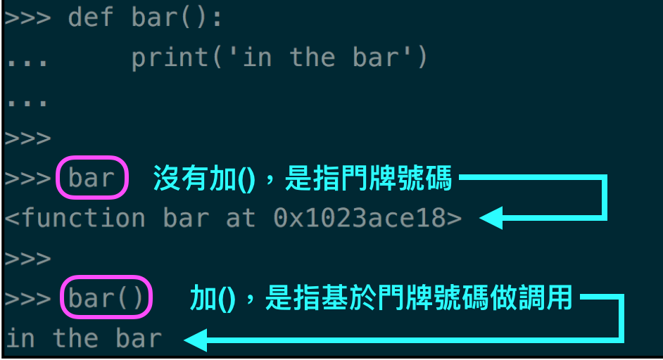
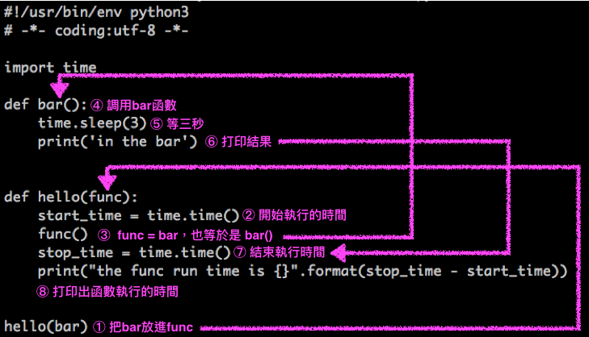
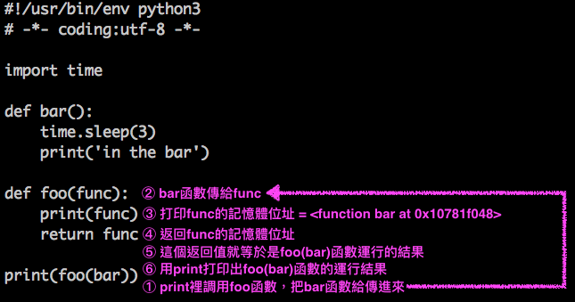

### 裝飾器前奏（高階函數）

#### 符合高階函數規則一

寫一個高階函數的代碼，並且去執行觀察一下

```
#!/usr/bin/env python3
# -*- coding:utf-8 -*-

def bar():
    print('in the bar')


def hello(func):
    print(func)
    
hello(bar)

---------------執行結果---------------

<function bar at 0x10ef18e18>

Process finished with exit code 0
```

結果發現是打印出一個記憶體位址，那再觀察一下，下面二個寫法的代碼會有什麼不同？


**寫法一: 調用hello函數時，不加()**

```
#!/usr/bin/env python3
# -*- coding:utf-8 -*-

def bar():
    print('in the bar')


def hello(func):
    print(func)
    func

hello(bar)

---------------執行結果---------------
<function bar at 0x10f586e18>

Process finished with exit code 0
```


**寫法二: 調用hello函數時，加()**

```
#!/usr/bin/env python3
# -*- coding:utf-8 -*-

def bar():
    print('in the bar')


def hello(func):
    print(func)
    func()

hello(bar)

---------------執行結果---------------

<function bar at 0x10b9c9e18>
in the bar

Process finished with exit code 0
```

有觀察出來什麼嗎？請看圖解



**小結**

寫法一，其實是指的是門牌號碼，這個門牌號碼會去幫你對應一個記憶體位址，也可以理解成我們把 bar 等於 func ，即 `func = bar` ，所以當寫法二的時候，要去運行時，我們就加個 `func()` 就可以正常調用了，也呼應了之前講的 `函數即變量` ，同時也符合了我們的高階函數的第一個規則，`把一個函數名當做實際參數傳給另一個函數`。


再寫一個高階函數的代碼，並且去執行觀察一下

**寫法三: 直接調用 bar 函數**

```
#!/usr/bin/env python3
# -*- coding:utf-8 -*-

import time

def bar():
    time.sleep(3)
    print('in the bar')


def hello(func):
    start_time = time.time()
    func()
    stop_time = time.time()
    print("the func run time is {}".format(stop_time - start_time))


bar()

---------------執行結果---------------

in the bar

Process finished with exit code 0
```

**寫法四: 直接調用 hello 函數**

```
#!/usr/bin/env python3
# -*- coding:utf-8 -*-

import time

def bar():
    time.sleep(3)
    print('in the bar')


def hello(func):
    start_time = time.time()
    func()
    stop_time = time.time()
    print("the func run time is {}".format(stop_time - start_time))


hello(bar)

---------------執行結果---------------

in the bar
the func run time is 3.004516839981079

Process finished with exit code 0
```

有觀察出來什麼嗎？請看圖解




**小結**

寫法三，會直接去調用 bar 函數，停三秒後，打印出結果，而寫法四，會先去調用 hello 函數(即裝飾器)，再去調用 bar 函數，這樣的寫法的好處是 `在不修改 bar 函數(被裝飾函數源代碼)的情況下，為它加上新的功能` ，這也符合高階函數的規則一。


#### 符合高階函數規則二

```
#!/usr/bin/env python3
# -*- coding:utf-8 -*-

import time

def bar():
    time.sleep(3)
    print('in the bar')

def foo(func):
    print(func)
    return func

print(foo(bar))

---------------執行結果---------------

<function bar at 0x10781f048>
<function bar at 0x10781f048>

Process finished with exit code 0
```

請看圖解說明



對於這上面這個寫法有什麼想法？是不是加個小括號就可以運行了！？

```
#!/usr/bin/env python3
# -*- coding:utf-8 -*-

import time

def bar():
    time.sleep(3)
    print('in the bar')

def foo(func):
    print(func)
    return func

#print(foo(bar))
foo(bar)    # 執行結果： <function bar at 0x106bc1048>
foo(bar())  # 執行結果：in the bar
                       None
```

來聊聊上面這個代碼有什麼分別？

* `foo(bar)` 把 bar 的記憶體位址傳給 func，接著打印出 bar 的記憶體位址，同時  `foo(bar)` 整個運行結果會返回一個記憶體位址。
* `foo(bar())` 加上小括號，就是調用 bar 函數，並把 bar 函數的返回值傳回來，這樣就違反了`高階函數的規則-不能修改被裝飾的函數的調用方式`，所以就不符合高階函數的定義。

那要如何才能達成高階函數的規則？

因為 `foo(bar)` 會返回一個記憶體位址，那就意謂著可以透過 `門牌號碼`，就可以取到返回值，那要怎麼取呢？請看下面代碼 

```
#!/usr/bin/env python3
# -*- coding:utf-8 -*-

import time

def bar():
    time.sleep(3)
    print('in the bar')

def foo(func):
    print(func)
    return func

#print(foo(bar))
x = foo(bar)
x()  # run bar

---------------執行結果---------------

<function bar at 0x10ed99048>
in the bar

Process finished with exit code 0
```

透過 `x` 這個門牌號碼來獲取 `foo(bar)` 的返回值，也就是先睡上三秒後，再打印結果，但這還沒達到高階函數的規則，所以再修改一下代碼。

```
#!/usr/bin/env python3
# -*- coding:utf-8 -*-

import time

def bar():
    time.sleep(3)
    print('in the bar')

def foo(func):
    print(func)
    return func

#print(foo(bar))
bar = foo(bar)  # 這樣就是加上了替 bar 函數加上新功能
bar()           # run bar

---------------執行結果---------------

<function bar at 0x10ed99048>
in the bar

Process finished with exit code 0
```

因為剛剛是透過 `x` 這個變量去獲取返回值的，但門牌號碼是可以更換，所以就把 `x` 換成 `bar` 這個變量，這樣就符合了 `高階函數的規則-不能修改被裝飾的函數的調用方式`。

