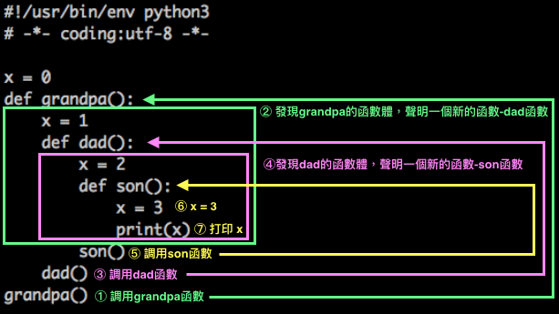

### 裝飾器前戲(嵌套函數)

#### 嵌套函數(nested)

什麼是嵌套函數？就是在函數裡面在去定義一個函數，這就是嵌套函數。

如果想要調用 bar 函數的話，要怎麼調用？下面代碼能執行嗎？

```
#!/usr/bin/env python3
# -*- coding:utf-8 -*-

def foo():
    print('in the foo')
    def bar():
        print('in the bar')

bar()

---------------執行結果---------------

Traceback (most recent call last):
  File "/Python/Project/path/decorator3.py", line 9, in <module>
    bar()
NameError: name 'bar' is not defined

Process finished with exit code 1
```

顯然是不行的，還記得之前說的 [Python 基礎 - 25 - 局部變量、全局變量和作用域](../Python%20基礎/Python%20基礎%20-%2025%20-%20局部變量、全局變量和作用域.md) 嘛？！因為 `def bar():` 在這個嵌套函數中是一個`局部變量`的關係，只在 foo 函數這個作用域裡生效，所以不能在外面調用，只能在內部調用，那來修正一下

```
#!/usr/bin/env python3
# -*- coding:utf-8 -*-

def foo():
    print('in the foo')
    def bar():
        print('in the bar')

    bar()
foo()

---------------執行結果---------------

in the foo
in the bar

Process finished with exit code 0
```

唔 ~ 這樣就正常執行了。

那請觀察下面這個代碼，是嵌套函數的一種嗎？

```
def foo_1():
    print('in the foo_1')
    foo_2()

def foo_2():
    print('in the foo_2')

foo_1()
```

答案是：`它不是嵌套函數` ，這是因為 `foo_2()` 是調用函數

`所謂嵌套函數的定義是在一個函數體內，用 def 去聲明一個新的函數，而不是去調用它。`

**局部作用域與全局作用域的訪問順序**

```
#!/usr/bin/env python3
# -*- coding:utf-8 -*-

x = 0
def grandpa():
    x = 1
    def dad():
        x = 2
        def son():
            x = 3
            print(x)
        son()
    dad()
grandpa()
```

請問 `x`打印出來會是多少？答案是3

那為什麼是 3 呢？請看圖解



一開始 x=0，調用 grandpa 函數，這時候全局變量的 x 就被局部變量的給改變了，此時 x=1 ，接著又看到了 `def dad():` 就相當於定義了一個變量，所以 x=2，接著又看到了  `def son():` 也是等於定義了一個變量，這時候 x=3 ，並且被打印出來。

**實驗：**

* 請註解 `dad()` ，並去觀察有什麼效果？
* 在這個例子中，可以從最裡面的x依序去註解，並且去觀察有什麼不同？

小結：

如果有去執行那二個小實驗的話，可以得出一個結論，就是 `作用域就是從裡面開始往外找，一層一層地去找。`
 


