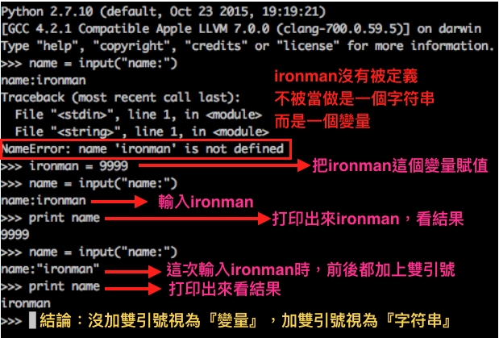
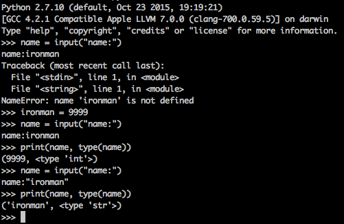

### 用戶交互程序

現在就來寫一個簡單的 `用戶輸入` 的程式，這是一個互動模式，需要使用者自已輸入

```
#!/usr/bin/env python3
# -*- coding:utf-8 -*-

username = input("username:")
password = input("password:")

print(username, password)

---------------執行結果---------------

username:ironman
password:tonystark
ironman tonystark
```

這個就是一個很簡單的互動輸入的小程式，透過 `input()` 就可以做出來的小功能
接下來再深入一點點，寫個顯示用戶的個人資訊

```
#!/usr/bin/env python3
# -*- coding:utf-8 -*-

name = input("username:")
age = input("age:")
job = input("job:")
salary = input("salary:")

# 開始做字符串格式化

info = '''                                    
---------- info of ''' + name + ''' ----------
Name: ''' + name + '''
Age: ''' + age + '''
Job: ''' + job + '''
Salary: ''' + salary + '''
'''

print(info)

---------------執行結果---------------

username:TonyStark   
age:38
job:ironman
salary:99999999999

---------- info of TonyStark ----------
Name: TonyStark
Age: 38
Job: ironman
Salary: 99999999999
```

上面的代碼就是一種字符串格式化的一種寫法，雖然寫起來有點醜，但還是可以使用的，可是有沒有漂亮一點點的寫法？
答案是有的，接下來就來依據之前的代碼來做修正

```
name = input("username:")
age = input("age:")
job = input("job:")
salary = input("salary:")

# 開始做字符串格式化

info1 = '''
---------- info1 of %s' ----------
Name: %s
Age:  %s
Job: %s
Salary: %s
''' %(name, name, age, job, salary)

print(info1)

---------------執行結果---------------

username:Bruce
age:35
job:Hulk
salary:0

---------- info1 of Bruce' ----------
Name: Bruce
Age:  35
Job: Hulk
Salary: 0
```

上面程式碼裡的 Name, AGE, JOB Salary 都是字符串跟 name, name, age, job, salary是沒有關係的
name, name, age, job, salary 所對應到的則都是 %s，這就是字符串格式化。

接下來再深入一點點，再修改上面的程式

```
name = input("username:")
age = input("age:")
job = input("job:")
salary = input("salary:")

# 開始做字符串格式化

info2 = '''
---------- info2 of %s ----------
Name: %s
Age:  %d   (這次修改成 %d, 來觀察一下有什麼差別？)
Job: %s
Salary: %s
''' %(name, name, age, job, salary)

print(info2)

---------------執行結果---------------

username:Bruce
age:35
job:Hulk
salary:0
Traceback (most recent call last):
  File "error/path/python/project/test.py", line 24, in <module>
    ''' %(name, name, age, job, salary)
TypeError: %d format: a number is required, not str
```

這次輸入後，發現錯誤了 `TypeError: %d format: a number is required, not str`，
這句話告訴我們輸入的一定要是數字，而不是字符串，(咦~奇怪，怎麼輸入的不是數字嗎？怎麼會是字串…？
好吧，我們來打印一下數據類型，確認到底是不是數字，在 `age` 下面新增一行代碼，
`print(type(age))  # 顯示變量的數據類型`

```
name = input("username:")
age = input("age:")
print(type(age))    # 顯示變量的數據類型
job = input("job:")
salary = input("salary:")

# 開始做字符串格式化

info2 = '''
---------- info2 of %s ----------
Name: %s
Age:  %d
Job: %s
Salary: %s
''' %(name, name, age, job, salary)

print(info2)

---------------執行結果---------------

username:Bruce
age:35
<class 'str'>  →  (真的是字符串，不是數字)
job:Hulk
salary:0
Traceback (most recent call last):
  File "error/path/python/project/test.py", line 24, in <module>
    ''' %(name, name, age, job, salary)
TypeError: %d format: a number is required, not str
```

好啦，確認上面的數字的確是 `str` 也就是 `字符串` 了，那我們要怎麼修正咧？
我們只好強制把 `age` 轉換成數字，那要如何修正？
請在 `age` 等號的右邊改寫成 `int(input("age:"))`

```
name = input("username:")
age = int(input("age:"))        # 在input前，加入int()強制轉換
print(type(age))        # 顯示變量的數據類型
job = input("job:")
salary = int(input("salary:"))

# 開始做字符串格式化

info3 = '''
---------- info3 of %s ----------
Name: %s
Age:  %d
Job: %s
Salary: %i
''' %(name, name, age, job, salary)

print(info3)

---------------執行結果---------------

username:Bruce
age:35
<class 'int'>
job:Hulk
salary:0

---------- info3 of Bruce ----------
Name: Bruce
Age:  35
Job: Hulk
Salary: 0
```


知識點： 

* `%` 是指執行字符串格式化
* `%s` 是指字符串在執行格式化之前透過 str() 來轉換，簡單說就是『字符串』  
* `%d` 是指數字，也是整數，這個跟 `%i` 都是一樣的功能
* `%f`  是指浮點數，有小數點的數字。


在 Python2.7 版中，`raw_input` 等於 Python3 版中的 `input`, 
然而在 Python2.7版中，也有一個叫 `input`, 你輸入什麼格式，它就接受什麼格式，
嗯，好像有點難懂，沒關係，來做個小實驗吧





下面這張圖有直接打印出 `print(name, type(name))` 直接驗証，上圖解釋是否正確





好，接下來再繼續介紹常見的字符串格式化


```
name = input("username:")
age = int(input("age:"))        
job = input("job:")
salary = int(input("salary:"))

# 開始做字符串格式化

info4 = '''
---------- info4 of {_name} ----------
Name: {_name}
Age:  {_age}
Job:  {_job}
Salary: {_salary}
'''.format(_name=name,
           _age=age,
           _job=job,
           _salary=salary)

print(info4)

---------------執行結果---------------

username:Potts
age:28
job:ceo
salary:99999

---------- info4 of Potts ----------
Name: Potts
Age:  28
Job: ceo
Salary: 99999
```

官方建議可以用這一個寫法 ↑↑


```
name = input("username:")
age = int(input("age:"))        
job = input("job:")
salary = int(input("salary:"))

# 開始做字符串格式化

info5 = '''
---------- info4 of {0} ----------
Name: {0}
Age:  {1}
Job:  {2}
Salary: {3}
'''.format(name,age,job,salary)


print(info5)

---------------執行結果---------------

username:Potts
age:28
job:CEO
salary:99999

---------- info4 of Potts ----------
Name: Potts
Age:  28
Job: CEO
Salary: 99999
```


知識點：

* 千萬不要使用 **`---------- info of ''' + name + ''' ----------`** 做字符串格式化，會大量占據內存的空間，導致效能很差
* 官方建議可以使用 **`---------- info4 of {_name} ----------`** 做字符串格式化


參考資料：
 [python_strings](https://www.tutorialspoint.com/python/python_strings.htm)