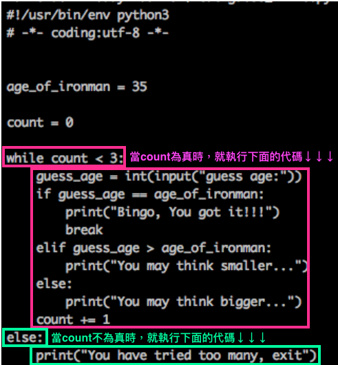

### while 流程判斷

接續上次的代碼，是不是只有執行一次才就結束，想要再繼續猜，就要在執行一次，是不是有點挺麻煩的？
所以這次我們就來再多做一點點功能進去，讓代碼可以多次循環地執行代碼，Go....


首先，我們先來了解一下，簡單的 `while循環` 怎麼寫

```
#!/usr/bin/env python3
# -*- coding:utf-8 -*-

count = 0

while True:
    print("count:", count)
    count += 1

---------------執行結果---------------

count: 70937
count: 70938
count: 70939
count: 70940
count: 70941
count: 70942
count: 70943
count: 70944
```

上面的代碼是一個簡單的 `while循環` ，這是一個無限的迴圈，只要while為真，就會一直執行不會中斷，需要由使用者自行中斷，簡單的會了，我們開始來結合上次的代碼

```
#!/usr/bin/env python3
# -*- coding:utf-8 -*-

age_of_ironman = 35

while True:
    guess_age = int(input("guess age:"))
    if guess_age == age_of_ironman:
        print("Bingo, You got it!!!")
    elif guess_age > age_of_ironman:
        print("You may think smaller...")
    else:
        print("You may think bigger...")

---------------執行結果---------------

guess age:23
You may think bigger...
guess age:98
You may think smaller...
guess age:84
You may think smaller...
guess age:35
Bingo, You got it!!!
guess age:
```

咦~有發現什麼不尋常的地方嗎？沒錯，即使你輸入正確了，這遊戲也不會結束，所以我們要在新增一個可以結束遊戲的條件
要怎麼結束呢？ 這時候必須在代碼中加入 `break` 就可以了，再修改一下代碼

```
#!/usr/bin/env python3
# -*- coding:utf-8 -*-

age_of_ironman = 35

while True:
    guess_age = int(input("guess age:"))
    if guess_age == age_of_ironman:
        print("Bingo, You got it!!!")
        break
    elif guess_age > age_of_ironman:
        print("You may think smaller...")
    else:
        print("You may think bigger...")

---------------執行結果---------------

guess age:39
You may think smaller...
guess age:28
You may think bigger...
guess age:59
You may think smaller...
guess age:39
You may think smaller...
guess age:35
Bingo, You got it!!!

Process finished with exit code 0
```

這樣又達成目的了，可是瑞凡，人家想要限制遊戲猜只能猜三次，三次猜不中就退出遊戲，又該怎麼寫呢？這時候就需要一個計數器來協助完成這次的任務，所以再為代碼稍稍加強一下功能

```
#!/usr/bin/env python3
# -*- coding:utf-8 -*-

age_of_ironman = 35

count = 0

while True:
    if count >= 3:
        break
    guess_age = int(input("guess age:"))
    if guess_age == age_of_ironman:
        print("Bingo, You got it!!!")
        break
    elif guess_age > age_of_ironman:
        print("You may think smaller...")
    else:
        print("You may think bigger...")
    count += 1

---------------執行結果---------------

# 故意猜超過三次，看看結果
guess age:1
You may think bigger...
guess age:1
You may think bigger...
guess age:1
You may think bigger...

Process finished with exit code 0


# 先試試在三次內打對密碼，看看結果
guess age:3
You may think bigger...
guess age:36
You may think smaller...
guess age:35
Bingo, You got it!!!

Process finished with exit code 0
```

hmm...上面代碼我們透過 `count` 這個計數器成功達成條件了，接下來要來想想，怎麼優化這個代碼？

上面代碼是不是可以把 `if count >= 3:` 放進 `while` 裡，修改一下代碼

```
#!/usr/bin/env python3
# -*- coding:utf-8 -*-

age_of_ironman = 35

count = 0

while count <= 3:
    guess_age = int(input("guess age:"))
    if guess_age == age_of_ironman:
        print("Bingo, You got it!!!")
        break
    elif guess_age > age_of_ironman:
        print("You may think smaller...")
    else:
        print("You may think bigger...")
    count += 1

---------------執行結果---------------

# 故意猜超過三次，看看結果
guess age:1
You may think bigger...
guess age:69
You may think smaller...
guess age:34
You may think bigger...

Process finished with exit code 0

# 先試試在三次內打對密碼，看看結果
guess age:32
You may think bigger...
guess age:35
Bingo, You got it!!!

Process finished with exit code 0
```

`while count < 3` 就會變成有條件的，當count 小於 3就執行，如果大於3，就不執行。 

但還是有稍微美中不足的地方，就是輸入超過三次，並沒有打印出任何訊息，會讓人感覺有點莫名其妙，所以再修改一下代碼


```
#!/usr/bin/env python3
# -*- coding:utf-8 -*-

age_of_ironman = 35

count = 0

while count <= 3:
    guess_age = int(input("guess age:"))
    if guess_age == age_of_ironman:
        print("Bingo, You got it!!!")
        break
    elif guess_age > age_of_ironman:
        print("You may think smaller...")
    else:
        print("You may think bigger...")
    count += 1

print("You have tried too many, exit")

---------------執行結果---------------
# 故意猜超過三次，看看結果
guess age:3
You may think bigger...
guess age:3
You may think bigger...
guess age:3
You may think bigger...
You have tried too many, exit

Process finished with exit code 0

# 先試試在三次內打對密碼，看看結果
guess age:4
You may think bigger...
guess age:35
Bingo, You got it!!!
You have tried too many, exit

Process finished with exit code 0
```
咦~怎麼打對密碼也顯示 `You have tried too many, exit`，看來還做得不夠好，再修改一下代碼

```
#!/usr/bin/env python3
# -*- coding:utf-8 -*-

age_of_ironman = 35

count = 0

while count <= 3:
    guess_age = int(input("guess age:"))
    if guess_age == age_of_ironman:
        print("Bingo, You got it!!!")
        break
    elif guess_age > age_of_ironman:
        print("You may think smaller...")
    else:
        print("You may think bigger...")
    count += 1

if count == 3:
    print("You have tried too many, exit")

---------------執行結果---------------
# 故意猜超過三次，看看結果
guess age:1
You may think bigger...
guess age:2
You may think bigger...
guess age:3
You may think bigger...
You have tried too many, exit

Process finished with exit code 0

# 先試試在三次內打對密碼，看看結果
guess age:15
You may think bigger...
guess age:35
Bingo, You got it!!!

Process finished with exit code 0
```

呼，這次終於都對了…
可是我們還有另一種更牛逼的寫法，是 Python 特有的寫法
就讓我們最後一次修改代碼，讓它看起來更牛逼點!!!


```
#!/usr/bin/env python3
# -*- coding:utf-8 -*-

age_of_ironman = 35

count = 0

while count <= 3:
    guess_age = int(input("guess age:"))
    if guess_age == age_of_ironman:
        print("Bingo, You got it!!!")
        break
    elif guess_age > age_of_ironman:
        print("You may think smaller...")
    else:
        print("You may think bigger...")
    count += 1
else:
    print("You have tried too many, exit")

---------------執行結果---------------
# 故意猜超過三次，看看結果
guess age:4
You may think bigger...
guess age:5
You may think bigger...
guess age:6
You may think bigger...
You have tried too many, exit

Process finished with exit code 0


# 先試試在三次內打對密碼，看看結果
guess age:7
You may think bigger...
guess age:67
You may think smaller...
guess age:35
Bingo, You got it!!!

Process finished with exit code 0
```

終於完成了，但這個是怎麼判斷的呢？請看下圖




