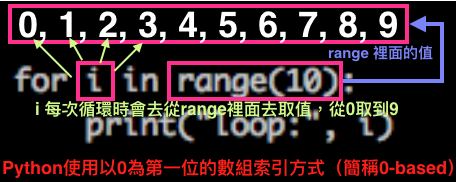
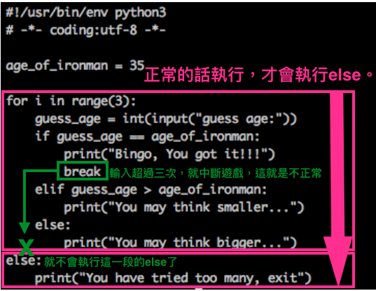
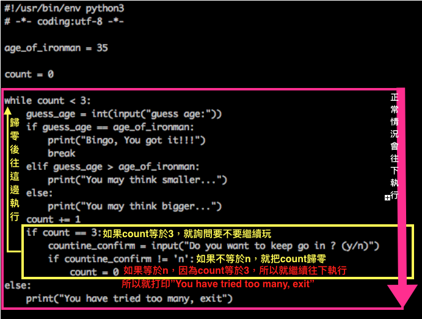

### for 流程判斷

今天介紹另一個循環判斷式 `for循環`，首先，先寫一個很簡單的 for循環的代碼

```
#!/usr/bin/env python3
# -*- coding:utf-8 -*-

for i in range(10):
    print("loop:", i)
    
---------------執行結果---------------

loop: 0
loop: 1
loop: 2
loop: 3
loop: 4
loop: 5
loop: 6
loop: 7
loop: 8
loop: 9

Process finished with exit code 0
```

那 for循環是怎麼跑的呢？請看下圖




接下來我們再來延伸一下，如果我想要把一開始的 `form循環` 每隔一個數字才打印出來，要怎麼實現？

```
#!/usr/bin/env python3
# -*- coding:utf-8 -*-

for i in range(0, 10, 2):
    print("loop:", i)
    
---------------執行結果---------------

loop: 0
loop: 2
loop: 4
loop: 6
loop: 8

Process finished with exit code 0
```

這樣就可以達成目的了，接下來要再提升一點難度，如何把 `for循環` 判斷式套用到猜年紀的遊戲中呢？忘記了請參考 [Python 基礎 - 5 - while 流程判斷](Python%20基礎%20-%205%20-%20while%20流程判斷.md) 的最後一個代碼


```
#!/usr/bin/env python3
# -*- coding:utf-8 -*-

age_of_ironman = 35

for i in range(3):
    guess_age = int(input("guess age:"))
    if guess_age == age_of_ironman:
        print("Bingo, You got it!!!")
        break
    elif guess_age > age_of_ironman:
        print("You may think smaller...")
    else:
        print("You may think bigger...")
else:
    print("You have tried too many, exit")

---------------執行結果---------------

# 故意猜超過三次，看看結果
guess age:1
You may think bigger...
guess age:2
You may think bigger...
guess age:3
You may think bigger...
You have tried too many, exit

Process finished with exit code 0

# 先試試在三次內打對密碼，看看結果
guess age:4
You may think bigger...
guess age:35
Bingo, You got it!!!

Process finished with exit code 0
```

上面的代碼因為用了 `for循環` 就不需要計數器了，因此就把 `count = 0` 跟 `count += 1` 給刪除了，就可以完成了，但是這段代碼的 `for循環` 又是怎麼跑的呢？請看下圖



再提升一下難度，這次需求是要讓這個遊戲可以讓任隨便玩，不過一樣要每三次問一下，要不要繼續玩？

```
#!/usr/bin/env python3
# -*- coding:utf-8 -*-

age_of_ironman = 35

count = 0

while count < 3:
    guess_age = int(input("guess age:"))
    if guess_age == age_of_ironman:
        print("Bingo, You got it!!!")
        break
    elif guess_age > age_of_ironman:
        print("You may think smaller...")
    else:
        print("You may think bigger...")
    count += 1
    if count == 3:
        countine_confirm = input("Do you want to keep go in ? (y/n)")
        if countine_confirm != 'n':
            count = 0
else:
    print("You have tried too many, exit")

---------------執行結果---------------

# 故意猜錯三次，第二次詢問時，選n
guess age:1
You may think bigger...
guess age:2
You may think bigger...
guess age:3
You may think bigger...
Do you want to keep go in ? (y/n)
guess age:4
You may think bigger...
guess age:5
You may think bigger...
guess age:6
You may think bigger...
Do you want to keep go in ? (y/n)n
You have tried too many, exit

Process finished with exit code 0
```

有發現上面代碼有一個怪怪的地方嗎？請看下圖說明



所以我們只要把需要註解或是刪除那二碼代碼即可

```
#!/usr/bin/env python3
# -*- coding:utf-8 -*-

age_of_ironman = 35

count = 0

while count < 3:
    guess_age = int(input("guess age:"))
    if guess_age == age_of_ironman:
        print("Bingo, You got it!!!")
        break
    elif guess_age > age_of_ironman:
        print("You may think smaller...")
    else:
        print("You may think bigger...")
    count += 1
    if count == 3:
        countine_confirm = input("Do you want to keep go in ? (y/n)")
        if countine_confirm != 'n':
            count = 0

---------------執行結果---------------

# 故意猜錯三次，第二次詢問時，選n
guess age:1
You may think bigger...
guess age:2
You may think bigger...
guess age:3
You may think bigger...
Do you want to keep go in ? (y/n)y
guess age:4
You may think bigger...
guess age:5
You may think bigger...
guess age:6
You may think bigger...
Do you want to keep go in ? (y/n)n

Process finished with exit code 0
```


知識點：

* 語法：`range(start, stop[, step])` 裡面的 `step 預設是 1`


參考資料：

* [why the python use 0-based](http://www.vaikan.com/why-python-uses-0-based-indexing/)


