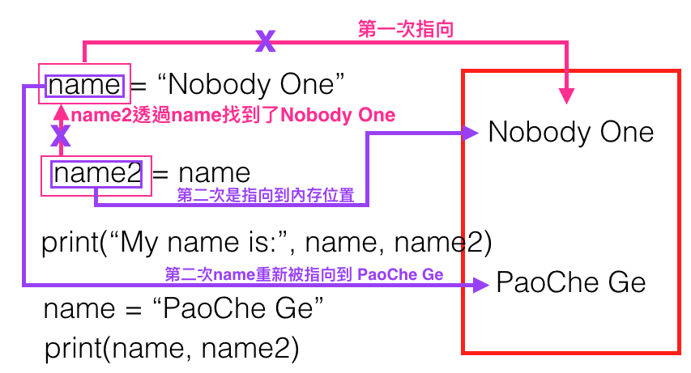

### 變量

變量主要是用來存東西，是存在內存裡

```
Python 變量寫法：

name = "Nobody One"

Shell Script 變量寫法：

name="Nobody One"
``` 

依照上面的代碼來看，語言的不同，變量使用的寫法也會不同
 
```
#!/usr/bin/env python3
# -*- coding:utf-8 -*-

name = "Nobody One"

name2 = name

print("My name is:", name, name2)

name = "PaoChe Ge"

print(name, name2)

-------------------------執行結果------------------------------

My name is: Nobody One Nobody One
PaoChe Ge Nobody One
```

下圖是說明上面代碼打印出來的結果，為什麼會是這樣跑，請看圖示：



變量定義的規則：

 1. 變量命名時，只能是字母、數字或是下劃線的任意組合，
 2. 變量命名時，第一個字符不能是數字
 3. package 及 module 的名稱中不要包含破折號 "-"
 4. 變量名前後不要加上二個下劃線
 5. 以下關鍵字不能聲明為變量名 

```
['and', 'as', 'assert', 'break', 'class', continue', 'def', 'del', 'elif', 'esle', 'except', 'exec, 'finally', 'for', 'form',

'global', 'if', 'import', 'in', 'is', 'lambda', 'not', 'or', 'pass', 'print', 'raise', 'return', 'try', 'while', 'with', 'yield']
``` 

註記：

 * 不要寫中文字當變量名，也不要使用拼音當變量名
 * Capitalized_Words_With_Underscores (ugly!) ← 這種變量名也不要使用，很醜 

 ```
 可以使用的二種命名變量的方式如下：
   1. 駝峰型： GFOfOldboy = "Chen rong hua"
   2. python官方建議是使用 gf_of_oldboy = "Chen rong hua"
 ``` 

常量

不會改變的變量，就是常量，但在 Python 中沒有常量的概念，所以如果要使用常量的話，建議都使用**全部大寫**的方式，這樣別人就可以知道，這是一個常量。

```
#!/usr/bin/env python3
# -*- coding:utf-8 -*-

MYSQL_USER_NAME = 'root'
MYSQL_ROOT_PASSWD = 'password'
MYSQL_CONNECTION_IP = '192.168.1.1'
``` 
