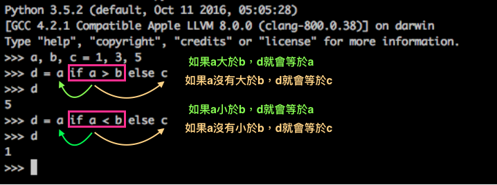
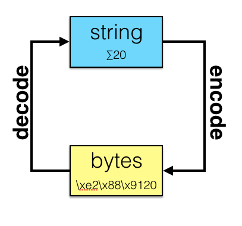
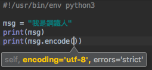

### 三元運算

什麼是三元運算？請看下圖說明



透過上圖說明後，可以得出一個三元運算公式： `result = 值1 if 條件 else 值2`，

* 如果鯈件為真: result = 值1
* 如果鯈件為假: result = 值2

如果不寫三元運算的話，那原本的代碼就會寫的較為冗長，就像下面的代碼

```
#!/usr/bin/env python3
# -*- coding:utf-8 -*-

a, b, c = 1, 3, 5

if a > b:
    d = a
else:
    d = c
print(d)

---------------執行結果---------------
5

Process finished with exit code 0
```


### 進制

* 二進制 - `01`
* 八進制 - `01234567`
* 十進制 - `0123456789` (我們生活用的就是十進制)
* 十六進制 - `0123456789ABCDEF` 


### bytes類型 (字節)

在 Python2 裡，字符串和字節常常傻傻分不清楚，字節可以把它理解為二進制的數據類型，字符串但在 Python3 裡，有一個專門的數據類型，就叫 `bytes 類型`。

Python3 最重要的特性大概算是對`文件與二進制數據`做了更清楚的區分。文件大都是用 `Unicode`，由 `str類型` 表示，二進制數據則由 `bytes 類型` 表示，在 Python3 不會以任意隱式的方式混用 `str` 和 `bytes`，也正因為這樣，所以你不能拼接字符串和字節包，也無法在字節包裡搜索字符串(反之亦然)，也不能將字符串傳入參數為字節包的函數(反之亦然)。

有沒有一種可能的情況是我的文件是存成二進制的話，那可不可以互相轉換？就像是之前提到過的，[Python 基礎 - 2 - 字符編碼](./Python%20基礎%20-%202%20-%20字符編碼.md) 裡，有 `ASCII` 、 `GB2312` 、 `GBK` 、 `GB 18030`等，不同的編碼之間不是可以互相轉換的，相對地，就如同 `str` 跟 `bytes` 也是可以互相轉換的，請看下圖說明



來簡單手動實驗一下


`↑↑↑請觀察輸出結果↑↑↑`，那寫在代碼裡，又該怎麼寫呢？


輸出不會出錯，是因為預設已經吃了 `utf-8`



但建議還是手動自已加上去，避免出錯


輸出結果

```
我是鋼鐵人
b'\xe6\x88\x91\xe6\x98\xaf\xe9\x8b\xbc\xe9\x90\xb5\xe4\xba\xba'

Process finished with exit code 0
```

再來試試把它還原回去字符串


輸出結果

```
我是鋼鐵人
b'\xe6\x88\x91\xe6\x98\xaf\xe9\x8b\xbc\xe9\x90\xb5\xe4\xba\xba'
我是鋼鐵人

Process finished with exit code 0
```

知識點：

* 什麼叫隱式？隱式就是 Python2 會自動幫你做轉換類型，例如，之前我們使用 `int (整數)` 時，當我們傳入的數值過大時，會自動幫你轉成 `long (長整數)`，但在 Python3 中，並不會幫你做這件事，要嘛給你出錯，要嘛就是自已手動執行。
* 在 Python2 裡，是可以互相拼接字符串和字節包，因為它們是一樣的東西。
* 有一種情況下，字符串一定要轉成二進制，在socket網路編程中，網路傳輸都是以二進制傳輸，`在 Python3 中，當所有數據要從 A 台電腦傳到 B 台電腦時，都是以二進制傳輸，因此務必要把字符串轉成二進制`，而在 Python2 中，因為字符串可以是直接傳輸。


參考資料：

[二进制数与十六进制数之间如何互相转换](http://jingyan.baidu.com/article/47a29f24292608c0142399cb.html)

[二、八、十、十六进制转换（图解篇）](http://www.cnblogs.com/gaizai/p/4233780.html)

[Unicode HOWTO](https://docs.python.org/3/howto/unicode.html)


