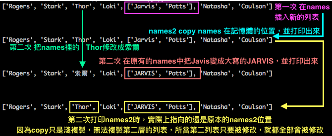

### 列表的使用_v2

接下來繼續講之前沒提到的 `copy()`，我們依續之前的列表，來做觀察，看看使用 `copy()` 有什麼不一樣？

```
#!/usr/bin/env python3
# -*- coding:utf-8 -*-

names = ["Rogers", "Stark", "Thor", "Loki", "Natasha", "Coulson"]

name2 = names.copy()
print(names)
print(name2)

---------------執行結果---------------

['Rogers', 'Stark', 'Thor', 'Loki', 'Natasha', 'Coulson']
['Rogers', 'Stark', 'Thor', 'Loki', 'Natasha', 'Coulson']

Process finished with exit code 0
```

看起來一樣，那接下來我們來修改一下，把 `Thor` 修改成中文 `索爾` ，來觀察一下結果

```
#!/usr/bin/env python3
# -*- coding:utf-8 -*-

names = ["Rogers", "Stark", "Thor", "Loki", "Natasha", "Coulson"]

name2 = names.copy()
print(names)
print(name2)

names[2] = "索爾"

print(names)
print(name2)

---------------執行結果---------------

['Rogers', 'Stark', 'Thor', 'Loki', 'Natasha', 'Coulson']
['Rogers', 'Stark', 'Thor', 'Loki', 'Natasha', 'Coulson']
['Rogers', 'Stark', '索爾', 'Loki', 'Natasha', 'Coulson']
['Rogers', 'Stark', 'Thor', 'Loki', 'Natasha', 'Coulson']

Process finished with exit code 0
```

嗯，看起來 `names` 裡的 `Thor` 已被修改成中文 `索爾`，而 `names2` 裡的 `Thor` 則是不變，接下來我們在來做個小變化，在現有的列表中，在插入一個列表

```
#!/usr/bin/env python3
# -*- coding:utf-8 -*-

names = ["Rogers", "Stark", "Thor", "Loki",["Jarvis", "Potts"], "Natasha", "Coulson"]

name2 = names.copy()
print(names)
print(name2)

names[2] = "索爾"

print(names)
print(name2)

---------------執行結果---------------

['Rogers', 'Stark', 'Thor', 'Loki', ['Jarvis', 'Potts'], 'Natasha', 'Coulson']
['Rogers', 'Stark', 'Thor', 'Loki', ['Jarvis', 'Potts'], 'Natasha', 'Coulson']
['Rogers', 'Stark', '索爾', 'Loki', ['Jarvis', 'Potts'], 'Natasha', 'Coulson']
['Rogers', 'Stark', 'Thor', 'Loki', ['Jarvis', 'Potts'], 'Natasha', 'Coulson']

Process finished with exit code 0
```

再來如果我想要把剛剛加進去的列表裡的 `Jarvis` 給變成大寫字母

```
#!/usr/bin/env python3
# -*- coding:utf-8 -*-

names = ["Rogers", "Stark", "Thor", "Loki",["Jarvis", "Potts"], "Natasha", "Coulson"]

name2 = names.copy()
print(names)
print(name2)

names[2] = "索爾"
names[4][0] = "JARVIS"

print(names)
print(name2)

---------------執行結果---------------

['Rogers', 'Stark', 'Thor', 'Loki', ['Jarvis', 'Potts'], 'Natasha', 'Coulson']
['Rogers', 'Stark', 'Thor', 'Loki', ['Jarvis', 'Potts'], 'Natasha', 'Coulson']
['Rogers', 'Stark', '索爾', 'Loki', ['JARVIS', 'Potts'], 'Natasha', 'Coulson']
['Rogers', 'Stark', 'Thor', 'Loki', ['JARVIS', 'Potts'], 'Natasha', 'Coulson']

Process finished with exit code 0
```

咦，有發現一個很神奇的問題嗎？為什麼 `names 裡的 JARVIS` 跟 `names2 的 JARVIS ` 是一樣都是`大寫`的？但為什麼之前的 `names 裡的索爾` 跟 `names2 裡的 Thor` 並沒有被複製過來，這個叫做 `淺copy()`，所謂的 `淺copy()` 就是只複製記憶體裡位置第一層的列表，這原理就有點像是我們之前在一開始所提到的[Python 基礎 - 01 - 變量.md](./Python%20基礎%20-%2001%20-%20變量.md)，不清楚的可以回頭看一下，或是看下圖我的理解



那如果想要真正全部的複製下來的話，這次我們引入一個 `import copy` 這個模塊來做完全複製

```
#!/usr/bin/env python3
# -*- coding:utf-8 -*-

import copy

names = ["Rogers", "Stark", "Thor", "Loki",["Jarvis", "Potts"], "Natasha", "Coulson"]

name2 = copy.copy(names)
print(names)
print(name2)

names[2] = "索爾"
names[4][0] = "JARVIS"

print(names)
print(name2)

---------------執行結果---------------

['Rogers', 'Stark', 'Thor', 'Loki', ['Jarvis', 'Potts'], 'Natasha', 'Coulson']
['Rogers', 'Stark', 'Thor', 'Loki', ['Jarvis', 'Potts'], 'Natasha', 'Coulson']
['Rogers', 'Stark', '索爾', 'Loki', ['JARVIS', 'Potts'], 'Natasha', 'Coulson']
['Rogers', 'Stark', 'Thor', 'Loki', ['JARVIS', 'Potts'], 'Natasha', 'Coulson']

Process finished with exit code 0
```

吚~結果居然跟上次`淺copy()`使用的一樣，其實是不一樣的，這個是完全複製下來了，只是我們要改成 `深copy()`，修改一下，再觀察一下

```
#!/usr/bin/env python3
# -*- coding:utf-8 -*-

import copy

names = ["Rogers", "Stark", "Thor", "Loki",["Jarvis", "Potts"], "Natasha", "Coulson"]

name2 = copy.deepcopy(names)
print(names)
print(name2)

names[2] = "索爾"
names[4][0] = "JARVIS"

print(names)
print(name2)

---------------執行結果---------------

['Rogers', 'Stark', 'Thor', 'Loki', ['Jarvis', 'Potts'], 'Natasha', 'Coulson']
['Rogers', 'Stark', 'Thor', 'Loki', ['Jarvis', 'Potts'], 'Natasha', 'Coulson']
['Rogers', 'Stark', '索爾', 'Loki', ['JARVIS', 'Potts'], 'Natasha', 'Coulson']
['Rogers', 'Stark', 'Thor', 'Loki', ['Jarvis', 'Potts'], 'Natasha', 'Coulson']

Process finished with exit code 0
```

嗯，看起來已經完全獨立複製一份了，但大多數情況下，不需要獨立在複製一份，這個如果當列表夠大時，做了`deepcoy()`會很占記憶體空間的，要小心使用。接下來要在試一下把列表做 `for循環`

```
#!/usr/bin/env python3
# -*- coding:utf-8 -*-

import copy

names = ["Rogers", "Stark", "Thor", "Loki",["Jarvis", "Potts"], "Natasha", "Coulson"]

for i in names:
    print(i)

---------------執行結果---------------

Rogers
Stark
Thor
Loki
['Jarvis', 'Potts']
Natasha
Coulson
```

嗯！很簡單，全部都有打印出來了，那如果想跳著打印列表的話，又該怎麼做？

```
#!/usr/bin/env python3
# -*- coding:utf-8 -*-

import copy

names = ["Rogers", "Stark", "Thor", "Loki",["Jarvis", "Potts"], "Natasha", "Coulson"]

print(names)
print(names[0:-1:2])

---------------執行結果---------------

['Rogers', 'Stark', 'Thor', 'Loki', ['Jarvis', 'Potts'], 'Natasha', 'Coulson']
['Rogers', 'Thor', ['Jarvis', 'Potts']]

Process finished with exit code 0
```

還記得之前有提到過，在列表裡，`0` 跟 `-1` 可以省略，那上面的代碼可不可以在優化一下

```
#!/usr/bin/env python3
# -*- coding:utf-8 -*-

import copy

names = ["Rogers", "Stark", "Thor", "Loki",["Jarvis", "Potts"], "Natasha", "Coulson"]

print(names)
print(names[::2])

---------------執行結果---------------

['Rogers', 'Stark', 'Thor', 'Loki', ['Jarvis', 'Potts'], 'Natasha', 'Coulson']
['Rogers', 'Thor', ['Jarvis', 'Potts'], 'Coulson']

Process finished with exit code 0
```

如果不跳著打印的話，也可以寫成

```
#!/usr/bin/env python3
# -*- coding:utf-8 -*-

import copy

names = ["Rogers", "Stark", "Thor", "Loki",["Jarvis", "Potts"], "Natasha", "Coulson"]

print(names)
print(names[:])   # 這個也可以 print(names[::])

---------------執行結果---------------

['Rogers', 'Stark', 'Thor', 'Loki', ['Jarvis', 'Potts'], 'Natasha', 'Coulson']
['Rogers', 'Stark', 'Thor', 'Loki', ['Jarvis', 'Potts'], 'Natasha', 'Coulson']

Process finished with exit code 0
```

 但這個就較不常使用，看起來比較不直覺。


