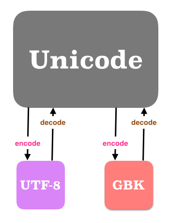

### 字符轉編碼

**回顧字符編碼的前世今生** 

`ASCII`  只能儲英文或特殊字符，只占一個字節，一個字節 8 bit，不能儲中文，所以才出現Unicode

`Unicode` 不管是中文或英文，都是占二個字節，一個字節 8 bit

`UTF-8` 是一種針對 Unicode 的可變長度字元編碼，英文字符一樣會依照 ASCII 碼規範，只占一個字節 8 bit，而中文字符的話，統一就占三個字節

回顧可以參考 [Python 基礎 - 02 - 字符編碼](./Python%20基礎%20-%2002%20-%20字符編碼.md)

**字符編碼解碼流程**

圖解當二種不同字符編碼的轉編、解碼的過程，例如我要把一個GBK的字符編碼轉成UTF-8的過程是怎麼轉換的

1. 首先通過編碼 **`decode`** 轉換為 **`Unicode`** 編碼
2. 然後通過解碼 **`encode`** 轉換為 **`UTF-8`** 編碼





那我們就先用 utf-8 轉 gbk ，來做實做看看…下面代碼都是先用 `python2.7版執行`

```
# -*- coding:utf-8 -*-

import sys
print(sys.getdefaultencoding())     # 打印出目前系統字符編碼

s = '你好'
s_to_unicode = s.decode(encoding='utf-8')  # 要告訴decode原本的編碼是哪種
print(s_to_unicode)

----------------------執行結果----------------------

ascii
你好
```

剛剛上面的代碼只是先做 `UTF-8 decode Unicode`，不相信!!! 好吧來驗証一下

```
# -*- coding:utf-8 -*-

import sys
print(sys.getdefaultencoding())     # 打印出目前系統字符編碼

s = '你好'
s_to_unicode = s.decode(encoding='utf-8')  # 要告訴decode原本的編碼是哪種
print(s_to_unicode)
print(s_to_unicode, type(s_to_unicode))

----------------------執行結果----------------------

ascii
你好
(u'\u4f60\u597d', <type 'unicode'>)   # 變成一個tuple，所以就不會顯示中文
```

上面那個看起來很像亂碼(不是亂馬)，其實是 unicode 格式，証明我們已經確實的把  `UTF-8 decode Unicode` 編碼了，再來就是要把 `Unicode encode gbk`

```
# -*- coding:utf-8 -*-

import sys
print(sys.getdefaultencoding())     # 打印出目前系統字符編碼

s = '你好'
s_to_unicode = s.decode(encoding='utf-8')
print(s_to_unicode)
print(s_to_unicode, type(s_to_unicode))

s_to_gbk = s_to_unicode.encode(encoding='gbk')
print(s_to_gbk)

----------------------執行結果----------------------

ascii
你好
(u'\u4f60\u597d', <type 'unicode'>)
���
```

上面代碼已經完成 `Unicode encode gbk`，但為什麼還是看不到字？那是目前的 terminal 的編碼依然是 `utf-8`，若想看到 `���` 的話，就請修改 `iTerm2 → Preference → Profiles → Terminal → Character Encoding → Chinese (GBK)` ，然後執行一次剛剛的代碼，執行的結果會如下

```
ascii
浣犲ソ
(u'\u4f60\u597d', <type 'unicode'>)
你好
```

原本第二行的`你好`變成`浣犲ソ`，而最後一行的`���`變成`你好`，這樣就可以確認我們真的已經完成 `UTF-8 decode Unicode → Unicode encode gbk` ，那如果要反向操作的話呢？

`Terminal 記得再調回成 UTF-8`，再執行一次

```
# -*- coding:utf-8 -*-

import sys
print(sys.getdefaultencoding())     # 打印出目前系統字符編碼

s = '你好'
s_to_unicode = s.decode(encoding='utf-8')
print(s_to_unicode)
print(s_to_unicode, type(s_to_unicode))

s_to_gbk = s_to_unicode.encode(encoding='gbk')
print(s_to_gbk)
print(s_to_gbk, type(s_to_gbk))

gbk_to_utf8 = s_to_gbk.decode(encoding='gbk').encode(encoding='utf-8')
print(gbk_to_utf8)
print(gbk_to_utf8, type(gbk_to_utf8))

----------------------執行結果----------------------

ascii
你好
(u'\u4f60\u597d', <type 'unicode'>)
���
('\xc4\xe3\xba\xc3', <type 'str'>)
你好
('\xe4\xbd\xa0\xe5\xa5\xbd', <type 'str'>)
```

再來動一個小小的手腳，來思考一下

```
# -*- coding:utf-8 -*-

import sys
print(sys.getdefaultencoding())     # 打印出目前系統字符編碼

s = u'你好'
print(s)
print(s, type(s))

s_to_unicode = s.decode(encoding='utf-8')
print(s_to_unicode)
print(s_to_unicode, type(s_to_unicode))

s_to_gbk = s_to_unicode.encode(encoding='gbk')
print(s_to_gbk)
print(s_to_gbk, type(s_to_gbk))

gbk_to_utf8 = s_to_gbk.decode(encoding='gbk').encode(encoding='utf-8')
print(gbk_to_utf8)
print(gbk_to_utf8, type(gbk_to_utf8))

----------------------執行結果----------------------

ascii
你好
(u'\u4f60\u597d', <type 'unicode'>)
Traceback (most recent call last):
  File "encode.py", line 10, in <module>
    s_to_unicode = s.decode(encoding='utf-8')
  File "/System/Library/Frameworks/Python.framework/Versions/2.7/lib/python2.7/encodings/utf_8.py", line 16, in decode
    return codecs.utf_8_decode(input, errors, True)
UnicodeEncodeError: 'ascii' codec can't encode characters in position 0-1: ordinal not in range(128)
```

咦，`u'你好'` 這個 u 是什麼呢？是指 unicode，但…為什麼第二行可以被打印出來？是因為…別忘了，`UTF-8 是 Unicode其中一個的擴展集`，所以可以正常打印出來 utf-8 格式，再來要怎麼修改上面出錯的代碼？

```
# -*- coding:utf-8 -*-

import sys
print(sys.getdefaultencoding())     # 打印出目前系統字符編碼

s = u'你好'
print(s)
print(s, type(s))

s_to_gbk = s.encode(encoding='gbk')
print(s_to_gbk)
print(s_to_gbk, type(s_to_gbk))

gbk_to_utf8 = s_to_gbk.decode(encoding='gbk').encode(encoding='utf-8')
print(gbk_to_utf8)
print(gbk_to_utf8, type(gbk_to_utf8))

----------------------執行結果----------------------

ascii
你好
(u'\u4f60\u597d', <type 'unicode'>)
���
('\xc4\xe3\xba\xc3', <type 'str'>)
你好
('\xe4\xbd\xa0\xe5\xa5\xbd', <type 'str'>)
```

接下來講 Python3 字符轉編碼的操作，先確認 Pycharm 的字符編碼是 UTF-8`(PyCharm Community Edition → Perferences → Editor → File Encodings → IDE Encoding → UTF-8)`，再來就要開始來實驗了


```
#!/usr/bin/env python3

import sys
print("目前系統字符編碼:", sys.getdefaultencoding())     # 打印目前系統字符編碼

s = '你好押'
s_to_gbk = s.encode(encoding='gbk')

print(s)
print(s_to_gbk)

----------------------執行結果----------------------

目前系統字符編碼: utf-8
你好押
b'\xc4\xe3\xba\xc3\xd1\xba'

Process finished with exit code 0
```

上面代碼的確認系統的編碼是 `utf-8` ，而`你好押` 變成了 `b'\xc4\xe3\xba\xc3\xd1\xba'`，在最前面的`b`指的就是[bytes類型](http://ithelp.ithome.com.tw/articles/10185614)，會變成這樣是因為Python3預設就是默認使用 `Unicode中的utf-8` ，而我們使用了 `s.encode(encoding='gbk')` ，導致它打印出來就是一個 `bytes類型` ，不相信！那我們來打印一個是 `utf-8的bytes類型`

```
#!/usr/bin/env python3

import sys
print("目前系統字符編碼:", sys.getdefaultencoding())     # 打印目前系統字符編碼

s = '你好押'
s_to_gbk = s.encode(encoding='gbk')

print(s)
print(s_to_gbk)
print(s.encode(encoding='utf-8'))

----------------------執行結果----------------------

目前系統字符編碼: utf-8
你好押
b'\xc4\xe3\xba\xc3\xd1\xba'
b'\xe4\xbd\xa0\xe5\xa5\xbd\xe6\x8a\xbc'

Process finished with exit code 0
```

唔…上面代碼第三個打印出來真的是 `utf-8的bytes類型` ，那再來把 gbk 轉成 utf-8

```
#!/usr/bin/env python3

import sys
print("目前系統字符編碼:", sys.getdefaultencoding())     # 打印目前系統字符編碼

s = '你好押'
s_to_gbk = s.encode(encoding='gbk')

gbk_to_utf8 = s_to_gbk.decode(encoding='gbk').encode(encoding='utf-8')      # 先把gbk轉成unicode，再轉成utf-8

print(s)
print(s_to_gbk)
print(s.encode(encoding='utf-8'))
print("utf8:", gbk_to_utf8)

----------------------執行結果----------------------

目前系統字符編碼: utf-8
你好押
b'\xc4\xe3\xba\xc3\xd1\xba'
b'\xe4\xbd\xa0\xe5\xa5\xbd\xe6\x8a\xbc'
utf8: b'\xe4\xbd\xa0\xe5\xa5\xbd\xe6\x8a\xbc'

Process finished with exit code 0
```

嗯！有發現什麼嗎？沒錯，第三行跟第四行打印出來的結果是一樣的，這樣就証明了這真的就是utf-8的bytes類型，那如果要把第四行還原成字符串，要怎麼弄？

```
#!/usr/bin/env python3

import sys
print("目前系統字符編碼:", sys.getdefaultencoding())     # 打印目前系統字符編碼

s = '你好押'
s_to_gbk = s.encode(encoding='gbk')

gbk_to_utf8 = s_to_gbk.decode(encoding='gbk').encode(encoding='utf-8')     # 先把gbk轉成unicode，再轉成utf-8
gbk_to_utf8_str = s_to_gbk.decode(encoding='gbk').encode(encoding='utf-8').decode(encoding='utf-8')


print(s)
print(s_to_gbk)
print(s.encode(encoding='utf-8'))
print("utf8:", gbk_to_utf8)
print("utf8_str:", gbk_to_utf8_str)

----------------------執行結果----------------------

目前系統字符編碼: utf-8
你好押
b'\xc4\xe3\xba\xc3\xd1\xba'
b'\xe4\xbd\xa0\xe5\xa5\xbd\xe6\x8a\xbc'
utf8: b'\xe4\xbd\xa0\xe5\xa5\xbd\xe6\x8a\xbc'
utf8_str: 你好押

Process finished with exit code 0

```


知識點：

* `在 Python3 因為字串已經全部統一成 unicode ，所以不必在字符串前加上 u ，這是Python2 和 Python3 的重要差別之一，需要特別注意`


參考資料：

[瞭解Unicode](http://python.ez2learn.com/basic/unicode.html#id3)

[字符编码笔记：ASCII，Unicode和UTF-8](http://www.ruanyifeng.com/blog/2007/10/ascii_unicode_and_utf-8.html)

