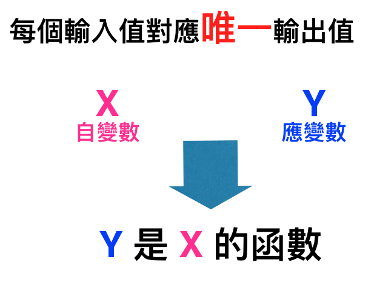

### 函數介紹

函數有分這幾種方法，簡單說可以把它想像是武林中各個不同門派，而各個門派中則有各自的獨門秘笈
                   
* 面向對象: 武當派 → 獨門秘笈: 類 → 實現方法: class
* 面向過程: 少林派 → 獨門秘笈: 過程 → 實現方法: def 
* 函數式編程: 明教 → 獨門秘笈: 函數 → 實現方法: def

那最後面二個都是 def，但有什麼區別呢？後面會在介紹 

### 函數

**數學定義**

請看下圖，在國中的數學裡，是這麼定義函數(Function) …



**編程語言中函數定義**

函數是邏輯結構化和過程化的一種編程方法

```
def test(x):
    """This is test function"""
    x += 1
    return x
```

* `def` 是定義函數的關鍵字
* `test` 是函數名稱
* `():` 代表裡面可以放參數，並且準備開始寫子代碼
* `"""This is test function"""` 是註解或是說明功能
* `x += 1` 代碼區或是程序處理邏輯
* `return x` 定義返回值

由於上面一開始有說 `def` 有二種定義，一是 `過程`，另一是 `函數`，現在就來解釋一下

```
#!/usr/bin/env python3
# -*- coding:utf-8 -*-

# 定義一個函數
def func1():
    """test1"""
    print('in the func1')
    return 0

# 定義一個過程
def func2():
    """test2"""
    print('in the func2')

x = func1()
y = func2()

---------------執行結果---------------

in the func1
in the func2

Process finished with exit code 0
```

上面代碼有什麼區別，應該很容易看出來吧？！沒錯，`def - 函數` 多了一個 `return 0` ，過程跟函數都是可以被調用，`過程實際上就是一個沒有返回值的函數而已`，那可以想像一下， `x = func1` 實際上是在接收 `return`的值，所以打印出來的應該會是 `0`，而 `y = func2` 因為沒有下 `return`，所以 `y的返回值應該會為空`，來實驗一下吧…

```
#!/usr/bin/env python3
# -*- coding:utf-8 -*-

# 函數
def func1():
    """test1"""
    print('in the func1')
    return 0

# 過程
def func2():
    """test2"""
    print('in the func2')

x = func1()
y = func2()

print('from func1 return is %s' %x)
print('from func2 return is %s' %y)

---------------執行結果---------------

in the func1
in the func2
from func1 return is 0
from func2 return is None

Process finished with exit code 0
```

這次把返回值給打印出來，有觀察出不一樣的地方吧，為什麼 `func2` 會顯示 `None`？是因為 Python 的解釋器`隱式`的打印出一個 `None`，也就是說，在 Python 中，過程也可以當做是一個函數，並且在解釋器中定義了過程的返回值為 `None`。

`面向過程`就是把你的功能或是邏輯包進去一個 `def 過程`的編程，想用調用時，就可以直接使用 `函數名稱()` 就可以了

知識點：

* `不是加上return值就是函數編程`


### 為什麼要用函數

假設我們來模擬寫 log 的檔案

```
#!/usr/bin/env python3
# -*- coding:utf-8 -*-

def test1():
    print('in the test1')

    with open('a.txt', w) as f:
        f.write('End action')
    
def test2():
    print('in the test2')

    with open('a.txt', w) as f:
        f.write('End action')
        
def test3():
    print('in the test3')

    with open('a.txt', w) as f:
        f.write('End action')
```

那有發現什麼問題嗎？上面代碼中，三個函數裡面都有同樣的代碼，這樣寫法不是說它是錯的，也是可用的，只是如果今天有 20 個函數，是不是就要複製 20 次，這樣不僅讓代碼看起來又臭又長，可讀性上也差了，所以我們可以透過之前介紹的`面向過程`把`同樣的代碼`包進一個函數，所以我們來修改一下

```
#!/usr/bin/env python3
# -*- coding:utf-8 -*-

def logs():
    with open('a.txt', 'a+') as f:
        f.write('End action\n')

def test1():
    print('in the test1')

    logs()

def test2():
    print('in the test2')

    logs()

def test3():
    print('in the test3')

    logs()


test1()
test2()
test3()

---------------執行結果---------------

in the test1
in the test2
in the test3

Process finished with exit code 0
```

然後再開啟 terminal ，會發現當前目錄下，會產生一個 `a.txt`的檔案

**觀察 a.txt 的內容**

```
End action
End action
End action
``` 

但這樣看起來 log 已經有寫進去了，但沒有時間，所以我們在新增一個時間戳記進去

```
#!/usr/bin/env python3
# -*- coding:utf-8 -*-

import  time

def logs():
    time_fomate = '%Y-%m-%d %X'
    time_current = time.strftime(time_fomate)
    with open('a.txt', 'a+') as f:
        f.write('%s End action\n' % time_current)

def test1():
    print('in the test1')

    logs()

def test2():
    print('in the test2')

    logs()

def test3():
    print('in the test3')

    logs()


test1()
test2()
test3()

---------------執行結果---------------

in the test1
in the test2
in the test3

Process finished with exit code 0
```
**再觀察一下 a.txt 的內容**

```
End action
End action
End action
2017-01-14 17:24:38 End action
2017-01-14 17:24:38 End action
2017-01-14 17:24:38 End action
``` 
唔！看起來已經成功了，那這樣有看出為什麼要使用函數了吧，如果還不懂，總結一下使用 `函數的三大好處`

**函數的三大好處**

1. 代碼重複使用
2. 保持一致性
3. 可擴展性


參考資料：

* [函數的定義](https://www.youtube.com/watch?v=Wd5Yv1-BqXw)
* [YAHOO知識-國中數學](https://tw.answers.yahoo.com/question/index?qid=20130407000015KK04888)
* [基礎數學pdf](http://ind.ntou.edu.tw/~metex/ch1.pdf)
* [函數wiki](https://zh.wikipedia.org/wiki/%E5%87%BD%E6%95%B0)