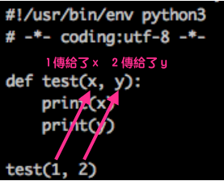

**函數中 return 返回值功能**

這次是要來說明一下， `return` 到底在函數中有什麼作用

```
#!/usr/bin/env python3
# -*- coding:utf-8 -*-

def test1():
    print('in the test1')
    return 0
    print('test end')

test()

---------------執行結果---------------

in the test1

Process finished with exit code 0
```

上面的代碼說明：

* 先打印出 `in the test1`
* `return` 其實就是`結束函數，並返回0` 這個值
* 因為已經結束函數，所以 `test end` 並不會被打印出來

那如果要接收 `return` 的返回值，要怎麼接收呢？其實很簡單，直接賦予一個 `變量`

```
#!/usr/bin/env python3
# -*- coding:utf-8 -*-

def test1():
    print('in the test1')
    return 0
    print('test end')

x = test1()
print(x)

---------------執行結果---------------

in the test1
0

Process finished with exit code 0
```

這樣就可以接收到 `return返回值`，那 `return返回值`可以接收哪幾種類型？

```
#!/usr/bin/env python3
# -*- coding:utf-8 -*-

def test1():
    print('in the test1')

def test2():
    print('in the test2')
    return 0

def test3():
    print('in the test3')
    return 1, 'hello', ['ironman', 'tony stark'], {'name':'tony'}

def test4():
    print('in the test4')
    return test2    # 高階函數

w = test1()
x = test2()
y = test3()
z = test4()
print('test1函數return值：', w)
print('test2函數return值：', x)
print('test3函數return值：', y)
print('test4函數return值：', z)

---------------執行結果---------------

in the test1
in the test2
in the test3
in the test4
test1函數return值： None
test2函數return值： 0
test3函數return值： (1, 'hello', ['ironman', 'tony stark'], {'name': 'tony'})
test4函數return值： <function test2 at 0x10a76b598>

Process finished with exit code 0
```

代碼說明：

* test1 函數，因為 Python 解釋器隱式返回了一個 `None`
* test2 函數，返回值為0
* test3 函數，則把上面的 `數字`、`字符串`、`列表`、`字典` 通通都放進了 `元組(tuple)`做為返回值，這個概念就想像去大賣場，買了很多東西，但要怎麼把這些東西通通都帶回家呢？就是使用`購物袋`，而 `tuple` 就可以把它想像成是一個 `購物袋`，這樣就可以把所有的返回值通通都帶回家了
* test4 函數，返回了 test2 函數的記憶體位址

總結：

* `返回值數=0，返回None`
* `返回值數=1，返回object`
* `返回值數>1，返回tuple`

為什麼要有返回值？簡單說就是 `取得整個函數執行完的結果`，可以提供給後面的程序使用。

**函數調用**

```
#!/usr/bin/env python3
# -*- coding:utf-8 -*-

def test(x, y):
    print(x)
    print(y)
    
test()

---------------執行結果---------------

Traceback (most recent call last):
  File "/Python/project/path/function_4.py", line 8, in <module>
    test()
TypeError: test() missing 2 required positional arguments: 'x' and 'y'

Process finished with exit code 1
```

上面代碼，如果直接調用就會噴 `error`，原因是因為少了二個 `位置參數` `x` and `y`，所以在調用時，定義二個值給 `x` and `y` 再執行一次

```
#!/usr/bin/env python3
# -*- coding:utf-8 -*-

def test(x, y):
    print(x)
    print(y)
    
test(1, 2)

---------------執行結果---------------

1
2

Process finished with exit code 0
```



* x and y = `形式參數`，如果不調用的話，是不會占記憶體空間的
* 1 and 2 = `實際參數`，實際會存在於記憶體裡的，會占空間的

假設如果再多給一個 `實際參數` 會發生什麼事呢？

```
#!/usr/bin/env python3
# -*- coding:utf-8 -*-

def test(x, y):
    print(x)
    print(y)
    
test(1, 2)

---------------執行結果---------------

Traceback (most recent call last):
  File "/Python/project/path/function_4.py", line 8, in <module>
    test(1, 2, 3)
TypeError: test() takes 2 positional arguments but 3 were given

Process finished with exit code
```

觀察上面結果是說，只有 2 個 `位置參數`，但給了 3 個 `實際參數` 所以無法執行，即然多一個不行，那如果少一個呢？

```
#!/usr/bin/env python3
# -*- coding:utf-8 -*-

def test(x, y):
    print(x)
    print(y)
    
test(1)

---------------執行結果---------------

Traceback (most recent call last):
  File "/Python/project/path/function_4.py", line 8, in <module>
    test(1)
TypeError: test() missing 1 required positional argument: 'y'

Process finished with exit code 1
```

再次觀察結果是說，少了一個 `y的位置參數`，由此可知， `位置參數跟實際參數是要一一對應` ，但有些情況下，我們並不做一一對應的話，又該怎麼做呢？這時候就可以使用 `關鍵字參數調用`

```
#!/usr/bin/env python3
# -*- coding:utf-8 -*-

def test(x, y):
    print(x)
    print(y)

test(1, 2)
test(y=3, x=4)

---------------執行結果---------------

1
2
4
3

Process finished with exit code 0
```

代碼說明：

* test(1, 2)			`位置參數跟實際參數是一一對應的`
* test(y=3, x=4) 	`實際參數與位置參數的順序是無關的`

那有沒有可能混用上面二種用法呢？答案是會有的

```
#!/usr/bin/env python3
# -*- coding:utf-8 -*-

def test(x, y, z):
    print(x)
    print(y)
    print(z)

test(1, y=2, 4)

---------------執行結果---------------

  File "/Python/project/path/function_4.py", line 9
    test(1, y=2, 4)
                ^
SyntaxError: positional argument follows keyword argument

Process finished with exit code 1
```

觀察上面代碼，是說語法錯誤，是因為`關鍵字參數不能寫在位置參數前面`，所以我們修改一下

```
#!/usr/bin/env python3
# -*- coding:utf-8 -*-

def test(x, y, z):
    print(x)
    print(y)
    print(z)

test(1, z=2, y=3)

---------------執行結果---------------

1
3
2

Process finished with exit code 0
```


參考資料：

* [positional-argument vs keyword-argument](http://stackoverflow.com/questions/9450656/positional-argument-v-s-keyword-argument)


