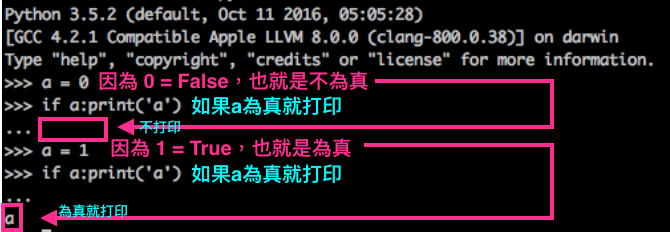

### 標準數據類型

|     | Python3 中有六個標準的數據類型 |
| --- | ------------------------------ |
| 1   | Number（數字）                 |
| 2   | String（字符串）               |
| 3   | List  （列表）                 |
| 4   | Tuple （元組）                 |
| 5   | Sets  （集合）                 |
| 6   | Dictionary（字典）             |
  

首先呢，我們先來介紹 `數字` 

### int(整數)

數字`2` 就是一個整數的例子，而`長整數`就是大一點的整數。

* 在 32 位元的機器上，整數的位數為 32 位，取值的範圍為 `-2**31 ~ 2**31-1` 即 `-2147483648 ~ 2147483648`
* 在 64 位元的機器上，整數的位數為 64 位，取值的範圍為 `-2**63 ~ 2**63-1` 即 `-9223372036854775808L ~ 9223372036854775807L`

在 Python2 裡，分`整數`跟`長整數`，請看下面就是一個 64 位系統所打印出來的

```  
Python 2.7.10 (default, Oct 23 2015, 19:19:21)
[GCC 4.2.1 Compatible Apple LLVM 7.0.0 (clang-700.0.59.5)] on darwin
Type "help", "copyright", "credits" or "license" for more information.
>>> type(2**32)
<type 'int'>
>>> type(2**62)
<type 'int'>
>>> type(2**63)
<type 'long'>
>>> type(2**64)
<type 'long'>
```

而在 Python3 裡，不管多大的數字，都只會顯示`整數`，已經沒有`長整數`的概念了，但其他語言仍然還是有`長整數`的概念

```
Python 3.5.2 (default, Oct 11 2016, 05:05:28)
[GCC 4.2.1 Compatible Apple LLVM 8.0.0 (clang-800.0.38)] on darwin
Type "help", "copyright", "credits" or "license" for more information.
>>> type(2**32)
<class 'int'>
>>> type(2**64)
<class 'int'>
>>> type(2**128)
<class 'int'>
>>> type(2**256)
<class 'int'>
>>> type(2**512)
<class 'int'>
>>> type(2**1024)
<class 'int'>
```

請注意，如果是其他語言的話，存超過限制的話，還是會發生錯誤，而在 Python 裡，則會自動幫你做轉換

### float(浮點數)

`一般人認知的浮點數就是有小數點的數字(廣義)`，其實不完全正確的，只是浮點數的表示型態是小數，但小數不止包括浮點，有點類似於 C 語言中的 Double 類型，占 8 個字節(64bit)，其中 52 bit 表示為底，11 bit 表示指數，剩下的 1 bit 表示符號。

`3.23`和 `52.3E-4`是浮點數的例子， `E`標記是表示 `10的冪數`。所以52.3E-4表示 `52.3* 10^4`。

```
Python 3.5.2 (default, Oct 11 2016, 05:05:28)
[GCC 4.2.1 Compatible Apple LLVM 8.0.0 (clang-800.0.38)] on darwin
Type "help", "copyright", "credits" or "license" for more information.
>>> 52.3E4
523000.0
>>> 52.3* 10**4
523000.0
```

### complex(複數) → 不常用

(-5+4j) 和 (2.3-4.6j) 都是複數的例子，其中 `-5`,`4`都為實數， `j` 為虛數，複數什麼情況會用到呢？大都是用在 `量子力學`、`空氣動力學`和`物理`相關的等，都是應用在工程相關方面的，一般我們會比較少用到。

### boolean(布林值) 或 (布爾值) → 常用，必會

它是只有兩種值的原始類型，通常是`True`和`False` 或是 `0` 和 `1`，請看範例圖



**Reference：**

* [Python數字類型](http://tw.gitbook.net/python/python_numbers.html)
* [浮點數維基](https://zh.wikipedia.org/wiki/%E6%B5%AE%E7%82%B9%E6%95%B0)
* [IEEE_754](https://zh.wikipedia.org/wiki/IEEE_754)
* [C語言浮點數](http://www2.lssh.tp.edu.tw/~hlf/class-1/lang-c/var-float.htm)
* [亂貼小站](http://taichunmin.pixnet.net/blog/post/27827769-float%E8%B7%9Fdouble%E5%B0%8F%E7%9F%A5%E8%AD%98)
* [Python 與複數計算](https://atedev.wordpress.com/2008/03/21/python-%E8%88%87%E8%A4%87%E6%95%B8%E8%A8%88%E7%AE%97/)
* [布林維基](https://zh.wikipedia.org/wiki/%E5%B8%83%E7%88%BE_(%E6%95%B8%E6%93%9A%E9%A1%9E%E5%9E%8B))
  
  
